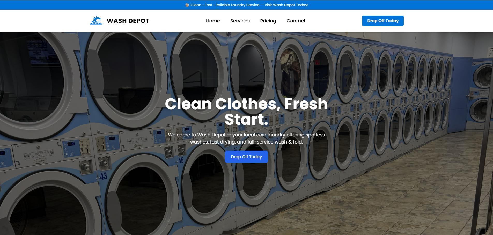

# 🧺 Wash Depot – Coin Laundry Website  

> **Modern, responsive website for Wash Depot Coin Laundry built with React + Tailwind CSS.**  
> Clean design, simple navigation, and a professional look to represent our laundry services in Brampton, Ontario.  

---

## 🌐 Live Demo  
🔗 **[Visit the Website](https://wash-depot.vercel.app)**  

  
*(Optional: Replace this link with a screenshot from your deployed site)*  

---

## 🧩 Tech Stack  

| Technology | Description |
|-------------|--------------|
| ⚛️ **React (Vite)** | Front-end framework |
| 🎨 **Tailwind CSS** | Utility-first CSS framework for modern UI |
| 🚀 **Vercel** | Hosting and deployment |
| 💾 **GitHub** | Version control and collaboration |

---

## 🎨 Design Overview  

🧴 A **minimal, white-and-blue theme** inspired by professional laundry brands.  
The site is built for clarity, speed, and mobile responsiveness.

### ✨ Features  
- Clean, modern **navbar** with "Drop Off Today" CTA  
- Large **hero banner** with background image  
- Informative **services** and **pricing** sections  
- Simple, clear **contact page** with location & phone  
- Fully **responsive layout** across all devices  

---

## 🕗 Business Hours  

| Day | Hours |
|-----|--------|
| Monday – Friday | 8:00 AM – 8:00 PM |
| Saturday – Sunday | 7:00 AM – 8:00 PM |

📍 **Address:** 1785 Queen St E, Brampton, ON L6T 4S3  
📞 **Phone:** (905) 791-9274  

---

## ⚙️ Installation & Setup

Follow these steps to run the project locally:

```bash
# 1️⃣ Clone the repository
git clone https://github.com/YOUR_USERNAME/wash-depot.git

# 2️⃣ Move into the project folder
cd wash-depot

# 3️⃣ Install dependencies
npm install

# 4️⃣ Start the development server
npm run dev


## 👨‍💻 Author

**Mohammad Parsafard**  
📍 Ontario, Canada  
💼 (https://github.com/Mohammad-prs)

---

## 💙 Credits

Built with ❤️ using:  
**React + Tailwind CSS + Vite**  
Deployed on **Vercel**